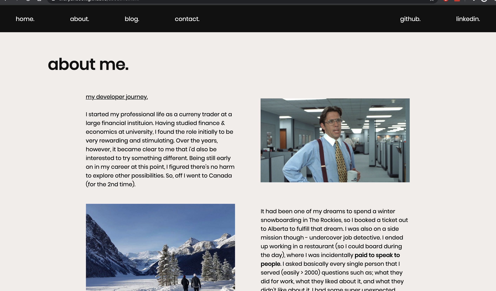

# Ryan Cook Portfolio Website - T1A3
Website: https://theryancook.github.io/
GitHub: https://github.com/theryancook/theryancook.github.io

## Purpose
The portfolio sites serves several purposes.
1) as a showcase to potential employers, relevant projects which I have completed
2) demonstrating my aptitude and knowledge of specific programming languages and frameworks
3) revealing a little about who I am personally

## Functionality / Features
### Component 1: Navigation Bar
Enables users to efficiently navigate around the site. Extra detail was paid to keeping it simple.

### Component 2: Target Links
There's a school of thought in UX that suggests the fewer clicks you have the better.
This is why I have displayed my projects on the main page. They are clickable, and will take people directly to the project itself, as well and having another clickable link directly underneath to take people to the code base on GitHub. Since recruiters or hiring managers may not have the time to search around, it makes sense to keep things as simple and accessable as possible.

### Component 3: Link Transitions
I've used different methods to ensure people are aware specific links exist.
1) for the nav bar, the link bottons that change colour
2) for text links, i've used intendation (>) and changed the colour upon hover
3) for images, i've given them a shadow box as well as a transform to enlarge the image

### Component 4: Accessibilty
Used the alt tags to assist visually impaired persons using the site

## Sitemap

## Wireframe

## Screenshots

## Target Audience
Potentially employers at companies who i've reached out to or recruiters for companies within the industry.

## Tech Stack
HTML, CSS & GitHub

## Project Management
Trello was used for project management, with the tasks mapped to each day then moved to complete or check box completed.
